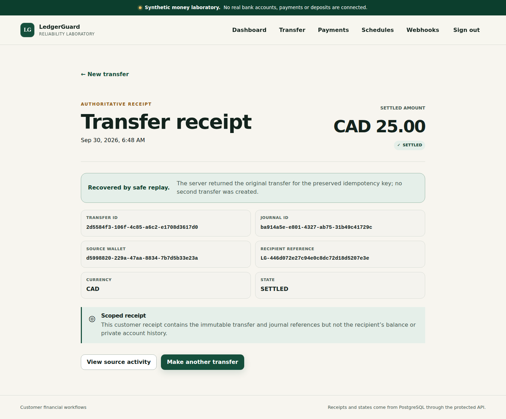

# Deadpan — Reusable Test Infrastructure for SaaS Teams

Deadpan is an open-source TypeScript quality platform built around Playwright Test rather than replacing it. It provides validated configuration, deterministic identities and data, guarded API/database helpers, normalized shard evidence, strict report merging, transparent flake statistics, accountable quarantine metadata, centralized quality gates, a scaffolding CLI, and a GitHub Action entrypoint.

## Inspect the product in two minutes

Deadpan turns a distributed test run into something an engineer can actually inspect: the gate decision, every original attempt, missing evidence and comparable history. It keeps native Playwright and makes the evidence around it explicit.

```bash
npm ci --ignore-scripts
npm run demo:report
npm run forgeqa -- report serve evidence/report-demo
```

Open the loopback URL printed by the CLI. The report demo needs no database, credentials or hosted backend. Its data is clearly synthetic; it is a product walkthrough, not a passing-run receipt.

- Filter a recovered checkout and inspect its original failed attempt
- Open its local diagnostic, go back, and keep the same filtered context
- Switch to a narrow screen, sort by duration, or read the report without JavaScript
- Inspect the real [TeamBoard](docs/first-consumer.md) and [Bad Penny](docs/ledgerguard-consumer.md) consumer receipts separately

[Report guide](docs/guide/reports.md) · [Source-candidate quickstart](docs/guide/quickstart.md) · [Architecture](docs/architecture.md) · [Portfolio acceptance](docs/delivery/portfolio-readiness.md)

## Status and compatibility

This is a source-candidate portfolio project. The prepared 1.0.0 packages have real npm/pnpm acceptance through an owned loopback registry, including 88 clean executions across two genuine applications. [Exact acceptance](docs/delivery/real-registry-consumer-acceptance.json). Public npm publication, a public action release and documentation hosting have not been completed.

Deadpan is the project name. The existing `forgeqa` executable, `@azerish25-ux/forgeqa-*` package names, configuration keys and on-disk formats remain compatible. Historical receipts retain their original identifiers and exact source revisions.

[Current delivery checkpoint](docs/delivery/STATUS.md) · [Earlier acceptance milestones](docs/delivery/previous-milestones.md) · [Version and release boundaries](docs/guide/releases.md)

## Why it exists

SaaS teams frequently have Playwright suites but lack safe test-data ownership, deterministic execution identity, complete distributed-shard reconciliation, stable result contracts, honest retry metrics, and one policy engine shared by local and CI workflows. Deadpan makes those concerns explicit while preserving native Playwright locators, assertions, projects, traces, reporters, and scheduling.

## Packages

| Package | Responsibility |
|---|---|
| `@azerish25-ux/forgeqa-core` | configuration, identities, contracts, redaction, changed-area selection, gates |
| `@azerish25-ux/forgeqa-playwright` | native fixture extension and annotations |
| `@azerish25-ux/forgeqa-api` | origin-scoped HTTP client, deadlines, cancellation, bounded polling |
| `@azerish25-ux/forgeqa-test-data` | deterministic factories, namespaces, cleanup, guarded PostgreSQL adapter |
| `@azerish25-ux/forgeqa-reporter` | journals, integrity-aware shard merging, JSON/JUnit/Markdown/HTML |
| `@azerish25-ux/forgeqa-flake-analysis` | metrics, fingerprints, quarantine, history, comparisons |
| `@azerish25-ux/forgeqa-github` | GitHub Action runtime helpers |
| `@azerish25-ux/forgeqa-cli` | `forgeqa` command and safe initialization templates |

## Prepared packages in a real consumer



The actual browser consumer commits a synthetic transfer, loses its response, and
recovers the same transfer without a second financial effect. This screenshot
comes from a registry-installed version 1.0.0 candidate. It depicts the pinned
Bad Penny application, whose interface retains its LedgerGuard branding.
[Source and image digest](docs/assets/bad-penny-transfer.source.json) ·
[88 real-consumer executions and exact artifact acceptance](docs/delivery/real-registry-consumer-acceptance.json).
Public npm publication is still not claimed.

## Local verification

```bash
npm ci --ignore-scripts
npm run verify
npm run hardening
npm run test:benchmarks
npm run benchmark
node packages/cli/dist/cli.js --help
```

`npm run hardening` builds the exact source, runs invariant and seeded-defect suites, enforces 90% line and 85% branch coverage over the release-critical policy kernel, freezes pre-release package/action/report contracts, packs all eight packages, inspects their tarballs, and installs those exact tarballs in clean npm and pnpm consumers. `npm run benchmark` previews the hosted condition matrix without consuming runners; the authoritative measurements execute through `.github/workflows/benchmark.yml`.

No package registry credentials or paid infrastructure are required for source verification. See [first-consumer verification](docs/first-consumer.md) for actual execution and packed npm/pnpm adoption. The CLI exits with `0` for policy-compliant success, `1` for test/quality failure, `2` for invalid usage/configuration, `3` for infrastructure/report-integrity failure, and `130` for interruption.

## Example configuration

```ts
import { defineForgeConfig } from '@azerish25-ux/forgeqa-core';

export default defineForgeConfig({
  project: 'teamboard',
  environments: {
    local: { baseUrl: 'http://127.0.0.1:3000' }
  },
  browsers: ['chromium', 'firefox', 'webkit'],
  retries: process.env.CI ? 1 : 0,
  workers: 4,
  shards: 1
});
```

## Strict behavior

- A retry-recovered test remains visible as flaky and fails the default strict gate.
- Missing, duplicate, incompatible, incomplete, or corrupt shard evidence cannot merge to green.
- Quarantined tests remain in execution and failing quarantined tests still fail.
- Missing history is represented as insufficient data, not a zero flake rate.
- Unknown changed paths broaden to the full suite.
- HTTP writes are not retried unless the caller explicitly declares idempotency and supplies an idempotency key.
- Secrets are redacted from textual diagnostics, while binary traces and screenshots are treated as sensitive rather than falsely “sanitized.”
- Package candidates are accepted only after tarball-content checks and clean npm/pnpm installation through public interfaces.
- The aggregate `forgeqa-quality` check cannot pass unless the cross-platform, consumer, TeamBoard, LedgerGuard, hardening, and action lanes all pass.

## Repository map

- [`docs/architecture.md`](docs/architecture.md) — boundaries and data flow
- [`docs/configuration.md`](docs/configuration.md) — precedence and validation
- [`docs/security.md`](docs/security.md) — trust boundaries and artifact privacy
- [`docs/delivery/requirements.json`](docs/delivery/requirements.json) — broader factual status matrix
- [`docs/delivery/hardening-live-acceptance.md`](docs/delivery/hardening-live-acceptance.md) — exact Phase 10 hosted evidence
- [`docs/delivery/hardening-requirements.json`](docs/delivery/hardening-requirements.json) — Phase 10 gates and all 50 adversarial scenarios
- [`benchmarks/README.md`](benchmarks/README.md) — comparable conditions, evidence contracts, and interpretation rules
- [`docs/delivery/benchmark-requirements.json`](docs/delivery/benchmark-requirements.json) — Phase 11A implementation and hosted-acceptance boundary
- [`examples/demo-saas`](examples/demo-saas) — working TeamBoard application, PostgreSQL migrations and consumer suites
- [`consumers/ledgerguard`](consumers/ledgerguard) — executable API-first LedgerGuard consumer pinned to verified P07A source
- [`docs/ledgerguard-consumer.md`](docs/ledgerguard-consumer.md) — revision, trust, topology, package and evidence boundaries
- [`adrs`](adrs) — engineering decisions

## Current limitations

Deadpan is not yet a public release. The status ledgers retain `PARTIAL`, `IMPLEMENTED`, `BLOCKED`, or `NOT_RUN` where later hosted or external acceptance is required. The pinned Bad Penny/LedgerGuard consumer now has genuine API and three-engine browser acceptance; public-registry consumer acceptance is still pending. The benchmark execution system has five-repetition hosted acceptance; same-runner lifecycle profiling is accepted, while comparable distributed hardware remains incomplete. Deadpan does not yet claim published npm packages, an immutable public action release, a Marketplace listing, deployed versioned documentation, public-registry publication-recovery acceptance, or a completed final delivery audit.
